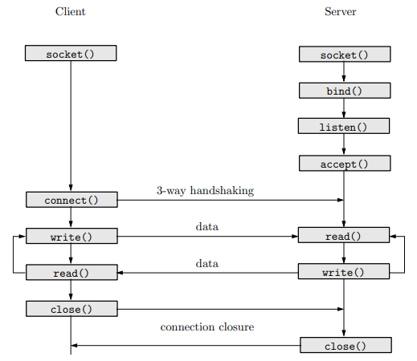

# FT_IRC
      
## Sommaire
- [Introduction](#Introduction)
- [Notions de bases](#Notions-de-bases)
- [Plan du projet](#Plan-du-projet)
    - [Creation du serveur](#Creation-du-serveur)
    - [ Implementation des commandes](#Implementation-des-commandes)
- [Notes](#Notes)
- [Ressources](#Ressources)
       
## Introduction
      
>On va creer notre propre serveur irc (Internet Relay Chat) en suivant le [protocole irc](https://datatracker.ietf.org/doc/html/rfc2812). 
>Ce protocole sera implemente grace a un systeme utilisant le protocole TCP/IP. 
       

## Notions de bases
+ serveur IRC
     - Concretement, un serveur IRC est un systeme de communication textuel via le reseau. Utilisant le modele serveur-client, ce protocole permet de l'adapter a de nombreuses plateformes comme messenger, twitter ou ~~MSN~~. 
     - Le serveur c'est le point central du systeme IRC, il fournit un point auquel les clients peuvent se connecter pour parler et permettre la connexion entre serveurs (partie qu'on ne doit pas implementer dans notre ft_irc)
     
+ client IRC
    - Un client IRC est tout simplement un element qui se connecte au serveur IRC qui n'est pas un serveur. TADAM :tada: 
    - Les clients se distinguent entre eux grace a un surnom qu'il est d'usage d'entrer des son entree dans le serveur ainsi que son username.  

+ TCP/IP
    - Le protocole TCP/IP (Transmission Control Protocol) permet de gérer les données en provenance (ou à destination) de la couche inférieure du modèle (c'est-à-dire le protocole IP). TCP est un protocole orienté connexion, c'est-à-dire qu'il permet à deux machines qui communiquent de contrôler l'état de la transmission.
    - Lors d'une communication à travers ce protocole, les deux machines doivent établir une connexion. La machine émettrice est appelée client, tandis que la machine réceptrice est appelée serveur. On dit qu'on est alors dans un environnement Client-Serveur.
    - Le protocole TCP/IP et le protocole IRC sont indissociables. Notre cher [arthur](https://github.com/arthur-trt) vous propose donc une comparaison plutot parlante : 
                → le protocole TCP est a considere comme la maniere de communiquer (ex: une lettre) tandis que le protocole IRC est la maniere de transmettre l'information (ex: dans la langue francaise). On ne peut donc pas obtenir tous les resultats attendus si on utilise pas les deux outils ensembles. 
    - Concretement, on va pas reimplementer le protocole TCP mais simplement l'utiliser. 

+ Sockets 
    -  Il s'agit d'un modele permettant la communication notamment a travers un réseau TCP/IP.
    -   Une fois qu'une connexion est établie, un fichier socket est utilisé pour identifier de façon unique la connexion.
    -   Une nouvelle petite analogie pour comprendre l'interet des sockets → la communication par sockets est souvent comparee aux communications humaines. On en distingue 2 types :
        * le mode connecte (ex : communication telephonique) utilisant le protocole TCP. La connexion durable etablie entre les deux processus permet de ne pas necessairement avoir besoin de l'adresse de destination a chaque envoi de donnees.
        * le mode non connecte (ex: communication par courrier) utilisant le protocole UDP. Ce dernier necessite l'adresse de destination a chaque envoi et il n'y a pas d'accuse de reception de celle ci. 

+ commandes IRC

/mnt/nfs/homes/clbouche/Downloads

## Plan du projet 

### Creation du serveur 

### Implementation des commandes

## Notes

## Ressources
